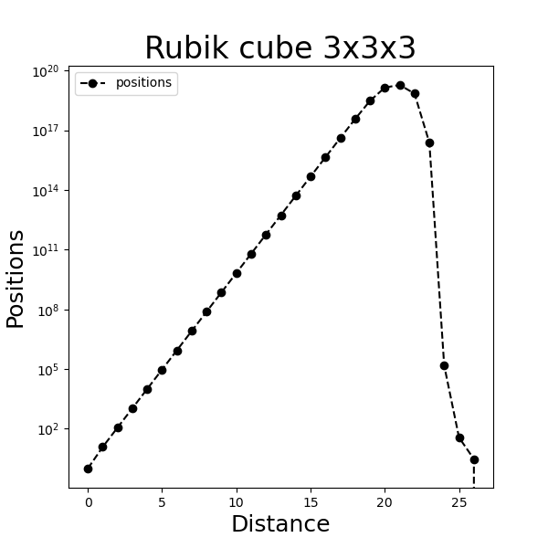

## Abstract

We perform a scrape over a website using the `requests` and `BeautifulSoup` Python modules. As a concrete example, let us take the [Rubik cube site](https://cube20.org/qtm/) that published the results proving any position of the 3x3x3 cube can be solved in no more than 26 moves. The authors prove that there exist a single maximally scrambled position out of the mind boggling 43,252,003,274,489,856,000 positions of the cube and it takes 26 moves in the Quarter Turn Metric to solve this position. All other positions take less than 26 moves.

>Our job is to extract the number of positions with distance and plot them as a neat matplotlib graph.

## Motivation
I arrived at this website while browsing [OpenAI](https://openai.com/) and how they developed a new machine learning model called [GPT-3](https://github.com/openai/gpt-3) that has upto 175 billion parameters for modelling datasets... Anyways I will write an article on that later once I get a grip on machine learning concepts after reading through the [blog of Andrei Karpathy](https://karpathy.github.io/).

## Context

Rubik cube fascinates many people due to the simplicity of the puzzle in terms of design yet complexity of the puzzle in terms of variations in the positions. One can start with a solved position and with few transformations, scramble it into a position apparently very different from the solved position. The mathematicians have come up with definitions to quantify how less or how more scrambled a Rubik cube is.

A position is any state of the Rubik cube.

A move is defined as any transformation on the cube. Moves include rotation of the faces.

For any position, distance  is defined as the minimum number of moves required to transform the cube into a solved position.

There are two metrics to define a move.

- Quarter Turn metric that considers any 90 degree turn as a move
- Half Turn metric that considers any of 90, 180, 270 degree turn as a move.

The authors asked the question

> What is the maximally scrambled position and what is its distance?

To answer the question

>  The authors took 29 CPU years of the Ohio Supercomputing Center!!!

and found that there exist only one unique position at at distance of 26 moves. Hence 26 is called the **God's number** in Rubik cube community jargon.

## Requirements

We need to setup a Python virtual environment with the following packages/modules.

- [BeautifulSoup](https://www.crummy.com/software/BeautifulSoup/)
- [Requests](https://2.python-requests.org/en/master/)
- numpy
- matplotlib
- ipython

## Installation

- Set up a Python virtual environment

        $py -m venv venv

- Activate the environment

        $.\venv\Scripts\activate

- run the script

        $python scraper.py

- Deactivate the environment

        $deactivate

## Output

The plot in log scale shows the dramatic rise in the number of positions with distance peaking at position 21. After the peak, there is sudden drop in the positions with only 36 positions for `distance 25` and only **1 position** for `distance 26`. The distance at which there is such a  unique position and its symmetric analogues is called the **God's number**.

## Under the hood

### Getting the HTML file

There are two ways to fetch the HTML file. Either directly requesting online the server for the page by sending a HTTP request to the site URL using `requests` module or by saving first the file offline. Either way is possible via the script.

Once we get the file, make a `beautiful soup` out of it by

    soup = BeautifulSoup(r.text, features="html.parser")

BeautifulSoup parses the HTML file and generates a tree representation of the HTML document. It uses `html.parser` for parsing the document. Other options like `lxml` and `html5lib` can also be given. On the [choice of the parser](If you can, I recommend you install and use lxml for speed), the documentation says

> If you can, I recommend you install and use lxml for speed

For the current project, we use `html.parser`.

### Scraping the data

BeautifulSoup provides methods to navigate, search and modify the tree structure.

On a preliminary investigation of the site as well as the HTML source, it is clear that the positions data is a table in the HTML document.

The table of interest

    <table class="leftfloat"><tbody><tr><th>Distance</th><th>Count of Positions</th>
    <th>Distance</th><th>Count of Positions</th></tr>
    <tr><td>0</td><td>1</td>
        <td>14</td><td>50,729,620,202,582</td></tr>
    <tr><td>1</td><td>12</td>
        <td>15</td><td>472,495,678,811,004</td></tr>
    <tr><td>2</td><td>114</td>
        <td>16</td><td>4,393,570,406,220,123</td></tr>
    <tr><td>3</td><td>1,068</td>
        <td>17</td><td>40,648,181,519,827,392</td></tr>
    <tr><td>4</td><td>10,011</td>
        <td>18</td><td>368,071,526,203,620,348</td></tr>
    <tr><td>5</td><td>93,840</td>
        <td>19</td><td>about 3,000,000,000,000,000,000</td></tr>
    <tr><td>6</td><td>878,880</td>
        <td>20</td><td>about 14,000,000,000,000,000,000</td></tr>
    <tr><td>7</td><td>8,221,632</td>
        <td>21</td><td>about 19,000,000,000,000,000,000</td></tr>
    <tr><td>8</td><td>76,843,595</td>
        <td>22</td><td>about 7,000,000,000,000,000,000</td></tr>
    <tr><td>9</td><td>717,789,576</td>
        <td>23</td><td>about 24,000,000,000,000,000</td></tr>
    <tr><td>10</td><td>6,701,836,858</td>
        <td>24</td><td>about 150,000</td></tr>
    <tr><td>11</td><td>62,549,615,248</td>
        <td>25</td><td>36?</td></tr>
    <tr><td>12</td><td>583,570,100,997</td>
        <td>26</td><td>3?</td></tr>
    <tr><td>13</td><td>5,442,351,625,028</td>
        <td>&gt;26</td><td>0</td></tr>
    </tbody></table>

To scrape the table, we run

         #find the table
         table = soup.find('table', class_="leftfloat")

Within the table, we run a row and column search for the `<td>` table data elements and store the cells in 2D list `lTable`

        # initialize list to store table cells
        lTable = []
        # scrape the table
        for row in table.find_all('tr'):
            #initialize a row list
            lRow = []
            #check if the row is a header and pass
            if row.find('th'):
                pass
            else:
                for column in row.find_all('td'):
                    lRow.append(column.string)

                #append the row list to the table list
                lTable.append(lRow)

These are handled by `printTableAsList()`

### Pruning the data

Not always the data is in convenient form. So we need to string manipulation. Having working knowledge of python string manipulation becomes handy during webscraping.

            #remove the commas in numbers
            numString = ''.join( [ char for char in column if char.isdigit() ] )

Removes the commas in between the digits of the large numbers as well as strings in the table cells.

### Plotting the data

Since the number of positions exponentially scale up with distance, we need to set the scale of y axis to `logscale`

    ax.set_yscale('log')

---

## References

- Wonderful [documentation of BeautifulSoup](https://www.crummy.com/software/BeautifulSoup/bs4/doc/)

- [Documentation of Requests](https://2.python-requests.org/en/master/)
